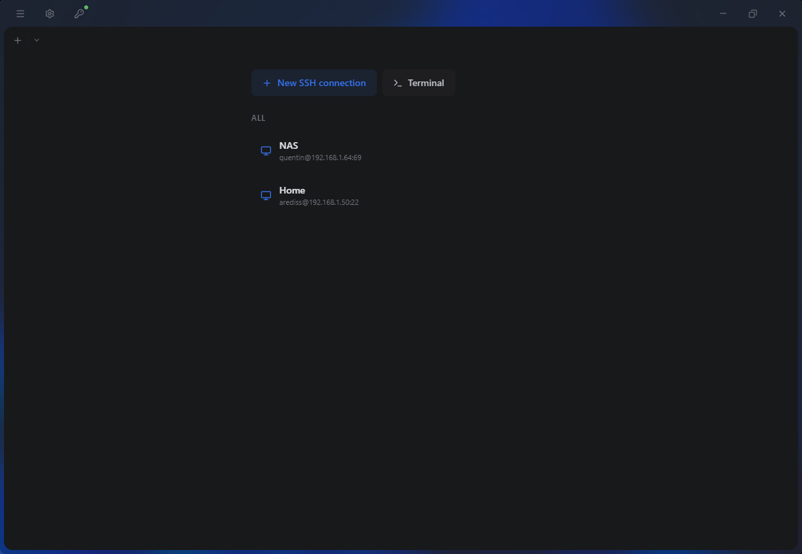

<p align="center">
  
</p>

<h1 align="center">SimplyTerm</h1>

<p align="center">
  A modern, secure SSH terminal client built with <strong>Tauri</strong>, <strong>React</strong>, and <strong>Rust</strong>.
</p>

<p align="center">
  
  
  
  <a href="https://sonarcloud.io/summary/new_code?id=arediss_SimplyTerm"></a>
  <a href="https://sonarcloud.io/summary/new_code?id=arediss_SimplyTerm"></a>
</p>

---

## Features

### Terminal
- Multi-tab interface with split panes (horizontal / vertical)
- Local shell and SSH connections
- Terminal search with regex support (`Ctrl+F`)
- Clickable URLs
- Customizable font, cursor style, and scrollback

### SSH
- Password and key-based authentication (RSA, ECDSA, ED25519)
- Host key verification (OpenSSH-compatible `known_hosts`)
- Session management with saved connections
- Quick reconnect from dropdown menu

### SFTP
- Integrated file browser
- Upload, download, rename, delete files and folders
- Create directories
- External editor integration with auto-sync

### Port Forwarding (Tunnels)
- Local forwarding (`-L`)
- Remote forwarding (`-R`)
- Dynamic SOCKS5 proxy (`-D`)
- Real-time transfer statistics

### Security
- Encrypted credential vault (AES-256-GCM + Argon2id)
- Multiple unlock methods: master password, PIN code, FIDO2 hardware keys
- Configurable auto-lock timeout
- Memory zeroization for secrets

### Extensibility
- Plugin system with sandboxed storage and permission model
- Sidebar views, context menus, session decorators, home panel columns, settings panels, and more
- Official plugin registry with SHA-256 integrity checks
- See [Plugin Documentation](docs/README.md) for details

### Other
- Command palette (`Ctrl+Shift+P`)
- Internationalization (English, French)
- Dark theme with customizable accent colors

---

## Plugins

SimplyTerm ships with an official [plugin registry](https://github.com/arediss/simplyterm-plugin-registry). Here are the featured plugins:

| Plugin | Description |
|--------|-------------|
| [Session Folders](https://github.com/arediss/simplyterm-folders) | Organize sessions into folders with drag-and-drop hierarchy |
| [Session Tags](https://github.com/arediss/simplyterm-tags) | Tag sessions with colored labels for quick filtering |
| [Recent Sessions](https://github.com/arediss/simplyterm-recent) | Track and quick-connect to recently used sessions |

Plugins are installed directly from **Settings > Plugins** inside the app.

> Want to build your own? Check the [Plugin Development Guide](docs/plugin-development.md).

---

## Installation

### Download

Pre-built binaries for Windows, macOS, and Linux are available on the [Releases](https://github.com/arediss/SimplyTerm/releases) page.

### Build from source

**Prerequisites:** [Node.js](https://nodejs.org/) v18+, [Rust](https://rustup.rs/) (stable), [Tauri prerequisites](https://tauri.app/v1/guides/getting-started/prerequisites)

```bash
git clone https://github.com/arediss/SimplyTerm.git
cd SimplyTerm

npm install
npm run tauri dev      # development
npm run tauri build    # production
```

---

## Keyboard Shortcuts

| Shortcut | Action |
|----------|--------|
| `Ctrl+T` | New local terminal |
| `Ctrl+N` | New SSH connection |
| `Ctrl+W` | Close current tab |
| `Ctrl+Shift+D` | Split vertically |
| `Ctrl+Shift+E` | Split horizontally |
| `Ctrl+F` | Search in terminal |
| `Ctrl+Shift+P` | Command palette |
| `Ctrl+,` | Settings |

---

## Contributing

Contributions are welcome! Feel free to open an issue or submit a pull request.

1. Fork the repository
2. Create your feature branch (`git checkout -b feature/amazing-feature`)
3. Commit your changes (`git commit -m 'Add amazing feature'`)
4. Push to the branch (`git push origin feature/amazing-feature`)
5. Open a Pull Request

---

## Tech Stack

- [Tauri](https://tauri.app/) — Desktop app framework
- [React](https://react.dev/) + [TypeScript](https://www.typescriptlang.org/) — Frontend
- [Rust](https://www.rust-lang.org/) — Backend
- [xterm.js](https://xtermjs.org/) — Terminal emulator
- [russh](https://github.com/warp-tech/russh) — SSH implementation
- [Lucide](https://lucide.dev/) — Icons

---

## Acknowledgments

- [Claude Code](https://claude.ai/claude-code) — AI-powered coding assistant
- [IntelliJ IDEA](https://www.jetbrains.com/idea/) — IDE
- [SonarCloud](https://sonarcloud.io/) — Code quality & security analysis

---

## License

MIT — see [LICENSE](LICENSE) for details.
